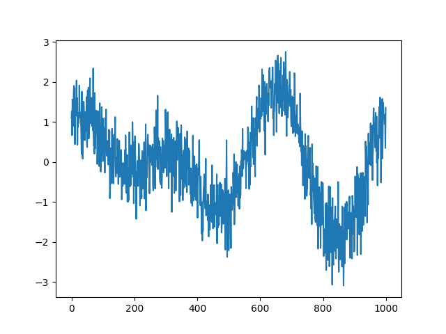
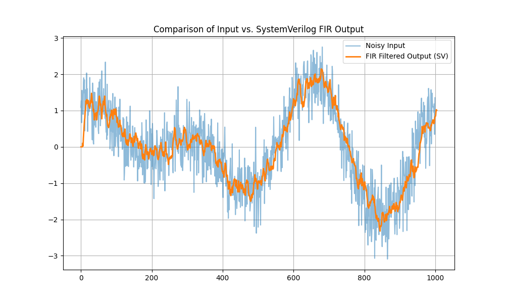

# fir_fpga
This project implements a pipelined FIR filter written in SystemVerilog.
The filter that is written here processes one input sample per clock cycle after pipeline fill and is suitable for real- time digital conditioning applications such as data acquisition systems or RF signal preprocessing.
Architecture
* Input: Streaming signed fixed - point samples
* Filter type : FIR(moving averge implementation)
* Pipeline depth: 5 stages
* Throughput : 1 sample/clock cycle

  
Pipeline stages:
  1) Input sample shift registers
  2) Parallel sample addition
  3) Intermediate addition
  4) Final accumulation
  5) Division by 8(via bit shifitng)

As an input to test the filter i used a linear combination of sin and cos the plot of which is shown right under

I then added random additive noise to the image

The singal, after beeing passed through the fir filter is as follows:

  
